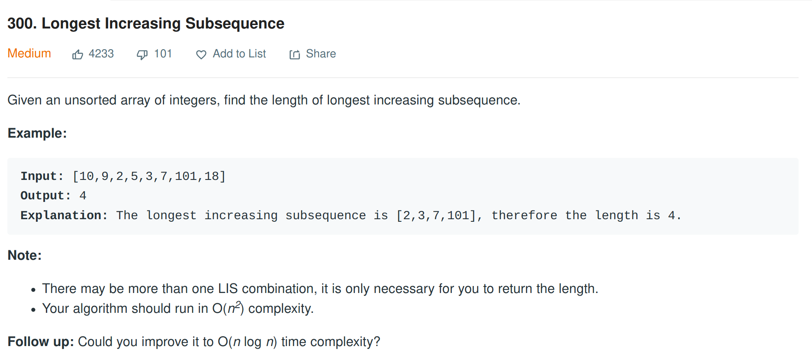

# Longest Increasing Subsquence

>
>  Hardness: [Medium](https://leetcode.com/problems/longest-increasing-subsequence/)
>
>  Date: 2020-05-23


## Desception



## Solution

注意子序列和子串的区别。子序列不一定连续，而子串则必然是连续的。

本题采用动态规划法。我们定义数组dp，令dp[i]表示从开始到数组的第i个数之间的最长递增子序列。很容易发现，dp[i]的结果依赖于dp[i-1]，即为问题具有最优子结构性质。

dp[i]至少为1，因为递增子序列至少包含一个元素，并且也是当前初始条件。从数组中第一个值arr[0]依次往后遍历，每到一个新的下标i，检查该位置的元素是否大于它前面子数组中的任意元素arr[j]。如果大于，那么更新当前元素的dp值，更新为当前dp[i]和dp[j]+1二者中的较大者。C++代码如下：

```c++
#include <vector>
#include <algorithm>

using std::fill;
using std::vector;
using std::max;

class Solution {
public:
    int lengthOfLIS(vector<int>& nums) {
      if (nums.empty()) return 0;
      int dp[nums.size()];
      fill(dp,dp+nums.size(), 1);  //将dp数组所有元素初始化为1

      for (int i = 0; i < nums.size();i++) 
        for (int j = 0; j < i;j++)
          if (nums[i] > nums[j]) dp[i] = max(dp[i], dp[j] + 1); // 如果当前值大于前面子数组中的任意一个值，那么就更新当前值的dp

      auto len = std::max_element(dp, dp + nums.size());
      return *len;
    }
};
```

可以看到，采用动态规划。时间复杂度为O($n^2$)。

LeetCode上还有一个时间复杂度为O($nlogn$)的更优化算法。该算法基于[Patience Sorting](https://en.wikipedia.org/wiki/Patience_sorting),更详细的介绍可以见普林斯顿大学的这个[Lecture](https://www.cs.princeton.edu/courses/archive/spring13/cos423/lectures/LongestIncreasingSubsequence.pdf),简单总结如下。

Patience Sorting就是把一堆无序的牌分成几个不同的子堆，拆分的几个原则如下：

- 刚开始时候，没有任何堆，第一张牌构成第一个初始堆。
- 接下来一张张抽牌把它放进堆里，放牌的原则如下：
  - 不能把值大的牌放在值小的牌上面，如果出现了新牌值更大的情况，那就新建一个堆，把该牌放进去。
  - 当一张牌可以放进多个堆时，尽量把它放到最左边的那个堆
- 重复以上过程，直到牌抽完。此时堆的大小就是最长递增子列的长度。


我们的目标是让堆的数量尽可能小。并且可以清晰的看到，其实每一个堆都构成了一个下降的子序列，每个堆的堆顶牌值都构成一个递增子列。

在插入牌的过程中，我们需要知道该牌插入哪个堆。由于堆顶牌是有序的，所以我们可以通过二分查找找到待插入的堆。由此，该算法的时间复杂度为$O(nlogn)$。

Go代码如下：

```go


```
