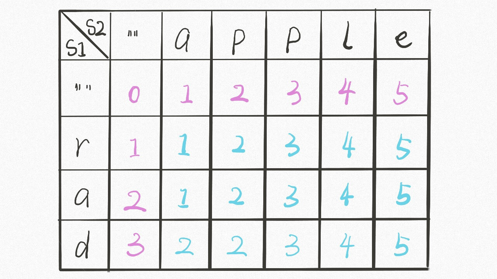

解决两个字符串的动态规划问题，一般是使用双指针法，不断的缩小问题规模。 

## 递归
首先，采用递归的方法，定义函数dp(i,j)，返回值为int，表示s1[0...i]到s2[0...j]的最小编辑距离。
如下图所示，一共会出现四种情况：
```
if s1[i] == s2[j]:
    啥都别做（skip）
    i, j 同时向前移动
else:
    三选一：
        插入（insert）
        删除（delete）
        替换（replace）
``` 
如下图所示：


当`s1[i] = s2[j]` 时，`dp(i,j) = dp(i-1,j-1)`.否则，我们就依次进行插入、删除和替换，并且选出三个操作中的最小返回值作为本次操作的最终值。

对于插入的情况，在s1的i位置之后插入`s2[j]`,然后继续向前移动j。即为`dp(i,j) = dp(i,j-1)+1`。

对于删除的情况，删除s1字符串i位置的元素，然后将i向前移动，即为，`dp(i,j) = dp(i-1,j) + 1`。

对于替换的情况，将s1下标i处的元素替换为s2下标j位置的元素，然后将i和j都向前移动。即为`dp(i,j)= dp(i-1,j-1) + 1`

将三者中的最小值作为本次操作的最终值，即为`dp(i,j) = min(dp(i,j-1)+1, dp(i-1,j)+1, dp(i-1,j-1)+1)`。

对于 base condition，则当j走完字符串而i未走完时，则删除i未走完的字符串，此时直接返回i+1。同理，对于i走完而j未走完时，也是删除并直接返回。

## 带DP数组的动态规划

对于使用递归的方法，很明显会涉及到很多重复计算，因而会产生效能上的影响。可以使用dp数组来减少重复计算。

很明显，dp应该是一个二维数组。dp[i][j] 代表 word1 到 i 位置转换成 word2 到 j 位置需要最少步数。

递归方法中，dp函数的base condition是 i = -1， 然而，数组的下标应该大于0，故而存在一位错位。



[详细可看这个链接](https://github.com/labuladong/fucking-algorithm/blob/master/%E5%8A%A8%E6%80%81%E8%A7%84%E5%88%92%E7%B3%BB%E5%88%97/%E7%BC%96%E8%BE%91%E8%B7%9D%E7%A6%BB.md)