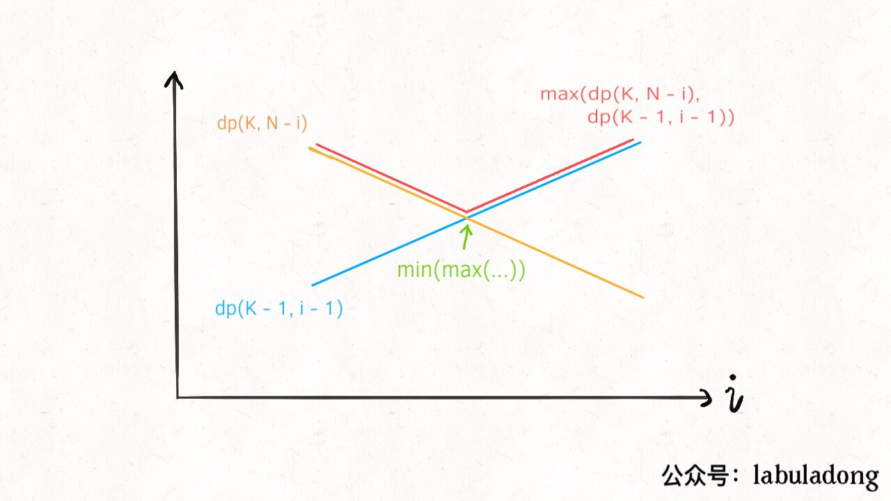

## 高楼扔鸡蛋

```
你面前有一栋从 1 到 N 共 N 层的楼，然后给你 K 个鸡蛋（K 至少为 1）。
现在确定这栋楼存在楼层 0 <= F <= N，在这层楼将鸡蛋扔下去，鸡蛋恰好没摔碎（高于 F 的楼层都会碎，低于 F 的楼层都不会碎）。
问，无论 F 的初始值如何，你确定 F 的值的最小移动次数是多少？
```

### 题意理解

题目「无论F的初始值如何」，意味着并不能单纯只考虑最好情况，而应该从最坏情况出发。所以，问题可以改造为「在最坏情况下，能够让你确定F的值的最小的移动次数是多少？」

最坏情况，意味着鸡蛋破碎一定发生在搜索区间穷尽时，也就是题目中所说的「最坏情况下」。而最少移动次数，意味着我们需要用到min函数。

### 题解

定义函数dp(L,K)，表示在L层楼，K个鸡蛋的情况下，确定F的值所需要的最小移动次数。需要特别注意这里的L，并不是指第L层楼，而是指L层楼，前者意味着一层楼，后者意味着一个区间。

从后续定义出的状态转移方式可以看出，移动次数并不与特定的楼层号发生关系，而是和楼层号所在的区间发生关系。也就是说，dp的值只与区间范围有关，而与特定的楼层值无关。

动态规划比较难的是定义出状态转移方程。可以看到，随着你的不断实验，鸡蛋数和楼层数都在发生改变，对应的的最小移动次数也在发生改变。也就是说，状态转移与楼层数L和鸡蛋个数K密切相关。

可以总结出dp(L,K)的状态转移方程。在楼层高度为L时，扔下鸡蛋，如果鸡蛋碎，说明F在L以下，那么dp(L,K) = dp(L-1,K-1)；如果鸡蛋没碎，说明楼层F在L以上，那么dp(L,K) = dp(N-L,K)。

注意没碎的情况下，是在N-L，而不是在L-1的区间内去进行递归。我们可以从这个角度去理解，对于每一层楼，扔一个鸡蛋下去，只会有两种状态，分别是鸡蛋碎了和鸡蛋没碎。对于任意一层楼来说，结果都是如此。

也就是说，我扔鸡蛋的次数不会和楼层的高度发生什么关系，但是会和楼层的数量发生关系。从这个角度出去去理解，应该能体会为什么是N-L，而不是L-1。

对于base condition，可以看到，如果鸡蛋个数为1，那么只能在每层楼都扔一次，类似线性扫描，从而最坏情况就是楼层高度N；如果楼层高度为0，那就不用扔鸡蛋了，直接返回0。从而可以写出伪代码：

```
func dp(N,K) int {
    int res = INF

    // 取min是为了获得最小次数，取max是为了获取最坏情况下的值
    // 从1开始是为了防止索引越界
    for 1<= i <= N {
        res = 
            min(res,max(dp(i-1,K-1),dp(N-i,K) + 1
    }
}
```
以上递归方法可以使用备忘录来减少重复计算，此时算法的时间复杂度为O(KN^2)，空间复杂度为O(KN)。

### 空间复杂度优化

针对以上解法，还有可优化的方法。我们可以把N和K看作是常数，对于dp函数而言，可以看到，随着楼层数N的增加，dp必然是单调增函数，那么对于上述的dp(K-1,i-1)和dp(K,N-i)而言，由于dp单增，可以把i看作变量，

那么就可以看到，dp(K-1,i-1)随着i增加而减小，而dp(K,N-i)随着i增长而减小，如图：


要求二者的最大值中的最小值，即为求拐点，因而可以采用二分查找进行优化，加快查找速度：
```
def superEggDrop(self, K: int, N: int) -> int:
        
    memo = dict()
    def dp(K, N):
        if K == 1: return N
        if N == 0: return 0
        if (K, N) in memo:
            return memo[(K, N)]
                            
        # for 1 <= i <= N:
        #     res = min(res, 
        #             max( 
        #                 dp(K - 1, i - 1), 
        #                 dp(K, N - i)      
        #                 ) + 1 
        #             )

        res = float('INF')
        # 用二分搜索代替线性搜索
        lo, hi = 1, N
        while lo <= hi:
            mid = (lo + hi) / 2
            broken = dp(K - 1, mid - 1) # 碎
            not_broken = dp(K, N - mid) # 没碎
            # res = min(max(碎，没碎) + 1)
            if broken > not_broken:
                hi = mid - 1
                res = min(res, broken + 1)
            else:
                lo = mid + 1
                res = min(res, not_broken + 1)

        memo[(K, N)] = res
        return res
    
    return dp(K, N)
```

上述时间复杂度为O(K\*N*logN)，空间复杂度为O(K\*N).

